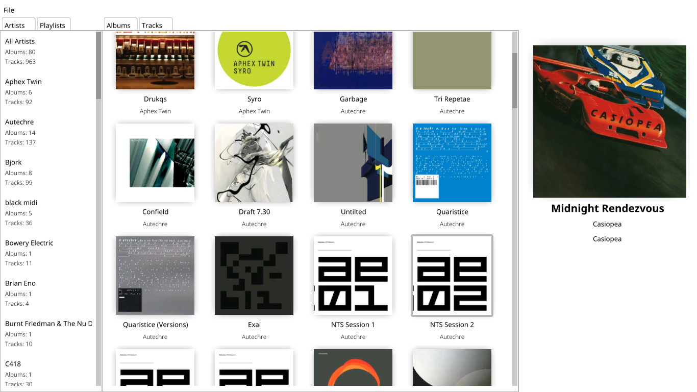

# portamento
Work in progress Music Player for linux.
Written in c89.
I have taken a break from this project because of school.

## Dependencies
- LibFLAC for reading metadata, might switch to something like taglib
in future.
- OpenGL and Nuklear.h for rendering the GUI.
- The following dependencies must be installed before compilation (Ubuntu)
```
sudo apt install libcurl4-openssl-dev libflac-dev libglew-dev
```

## Current Features:
- GUI rendered with opengl
- Multithreaded - Songs can be loaded in the background and the
metadata can be processed whilst the application is running.
- Album art images are stored in GPU memory.
  - They are also resized and compressed.
  - Because the images are stored on the GPU, this means the application
  doesn't use much RAM. Also, since the images are stored compressed
  in the GPU using a lossy compression method (DXT), it doens't use much
  GPU memory either.
- Album metadata is stored in an sql database for fast loading.
- Multithreaded event handling system.

## Current Missing Features
- As I've spent most of my time building a system to handle track metadata
and all this other stuff, I haven't actually implemented audio playback yet.
- I may also experiment with storing the album art images into a database.
- Shuffle play.
- Play lists.
